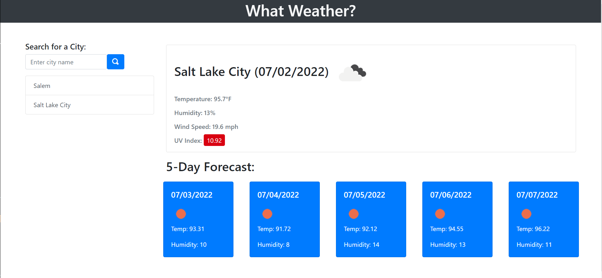

# What Weather?

  

## Description

A webpage that allows a user to see the weather outlook for multiple cities so they can plan a trip accordingly.

## Table of Contents
- [Usage](#usage)
- [License](#license)
- [Contributing](#contributing)
- [Questions](#questions)

## Usage

Visit the live page at: https://vrentadax.github.io/what-weather-v2/

  
## License

[https://choosealicense.com/licenses/mit](https://choosealicense.com/licenses/mit)

A short and simple permissive license with conditions only requiring preservation of copyright and license notices. Licensed works, modifications, and larger works may be distributed under different terms and without source code.
  

## Contributing

I can be contacted through the information provided in the 'Questions' section.

## Questions

If you have any qestions for me you can reach me here:

Github: https://github.com/vrentadax/
  
Email: vrentadax@outlook.com